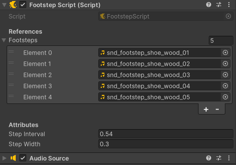

# footstep-script
A simple script for Unity to add footstep sounds.

A simple footstep script for Unity, developed in Unity Version 2022.3.4f.

e.g.
<video style="float: left; padding-right : 50px; padding-left : 250px; padding-bottom: 50px" width="465" controls>
      <source src="footstep_demo_video.mp4" type="video/mp4">
      <source src="footstep_demo_video.ogg" type="video/ogg">
      Your browser does not support HTML5 video.
</video>

Script Component Setup:

</img>

   

 
 
 
 

- Just drag the script onto your player/child game object in the inspector with a new, empty audio source and drop in your sounds!  
- Adjust the Step Interval to change how often the step sound plays while moving.  
- The Step Width affects the sound panning to left/right ear.

Feel free to use this in your commercial or creative projects. See attached Creative Commons License.
